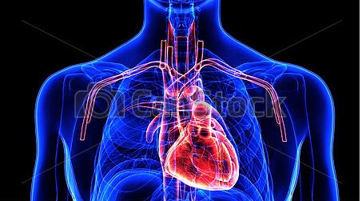

# Heart disease prediction:

Predicting whether heart disease present or not based on patient's blood pressure, sugar level, cholesterol, age, sex, heart rate etc.

[Click to view the project](https://github.com/rsaadiq/heart_disease_prediction/blob/master/Heart%20Disease%20Prediction.ipynb)
